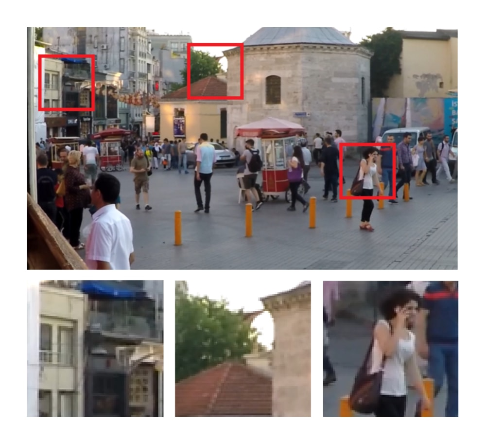

# DeblurGAN
[arXiv Paper Version](https://arxiv.org/pdf/1711.07064.pdf)

Pytorch implementation of the paper DeblurGAN: Blind Motion Deblurring Using Conditional Adversarial Networks.

Our networks takes blurry image as an input and procude the cirresponding sharp estimate, as in example:

Blurred Photo

Restored using out method

Sharp photo

Our model is Conditional Wasserstein GAN with Gradient Penalty + Perceptual loss based on VGG-19 activations

## How to run

### Prerequisites
- NVIDIA GPU + CUDA CuDNN (CPU untested, feedback appreciated)
- Pytorch

Download weights from [Dropbox](https://www.dropbox.com/sh/8oqo8eeq4zb75hw/AADcWCU9YcIJa1Q_OFHCNn8va?dl=0)
Put the weights into 
```bash
/.checkpoints/experiment_name
```
To test a model put your blurry images into a folder and run:
```bash
python test.py --dataroot /.path_to_your_data --model test --dataset_mode single --learn_residual
```

## Note: The repository is still being structured, the links to the data, weights and also instructions would be updated soon

## Acknowledgments
Code borrows heavily from [pix2pix](https://github.com/junyanz/pytorch-CycleGAN-and-pix2pix).


