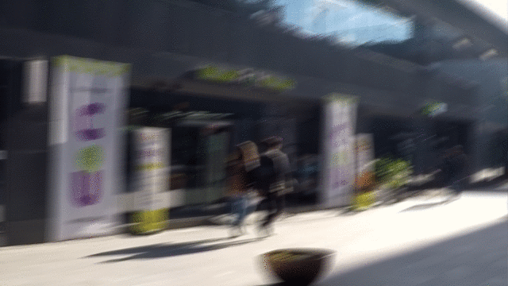
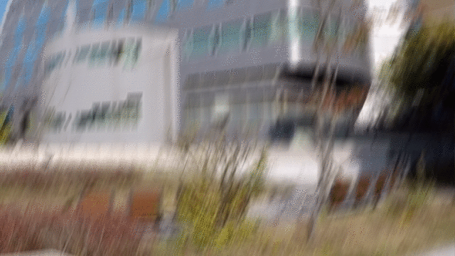

# DeblurGAN
[arXiv Paper Version](https://arxiv.org/pdf/1711.07064.pdf)

Pytorch implementation of the paper DeblurGAN: Blind Motion Deblurring Using Conditional Adversarial Networks.

Our network takes blurry image as an input and procude the corresponding sharp estimate, as in the example:
 


The model we use is Conditional Wasserstein GAN with Gradient Penalty + Perceptual loss based on VGG-19 activations. Such architecture also gives good results on other image-to-image translation problems (super resolution, colorization, inpainting, dehazing etc.)

## How to run

### Prerequisites
- NVIDIA GPU + CUDA CuDNN (CPU untested, feedback appreciated)
- Pytorch

Download weights from [Dropbox](https://www.dropbox.com/sh/8oqo8eeq4zb75hw/AADcWCU9YcIJa1Q_OFHCNn8va?dl=0) . Note that during the inference you need to keep only Generator weights.

Put the weights into 
```bash
/.checkpoints/experiment_name
```
To test a model put your blurry images into a folder and run:
```bash
python test.py --dataroot /.path_to_your_data --model test --dataset_mode single --learn_residual
```
## Data
Download dataset for Object Detection benchmark from [Google Drive](https://drive.google.com/file/d/1CPMBmRj-jBDO2ax4CxkBs9iczIFrs8VA/view?usp=sharing)

## Note: The repository is still being structured, the links to the data, weights and also instructions would be updated soon
The code used to create the paper contains a bug in PSNR calculation, results recalculation are in progress.

## Citation

If you find our code helpful in your research or work please cite our paper.

```
@article{DeblurGAN,
  title = {DeblurGAN: Blind Motion Deblurring Using Conditional Adversarial Networks},
  author = {Kupyn, Orest and Budzan, Volodymyr and Mykhailych, Mykola and Mishkin, Dmytro and Matas, Jiri},
  journal = {ArXiv e-prints},
  eprint = {1711.07064},
  year = 2017
}
```

## Acknowledgments
Code borrows heavily from [pix2pix](https://github.com/junyanz/pytorch-CycleGAN-and-pix2pix). The images were taken from GoPRO test dataset - [DeepDeblur](https://github.com/SeungjunNah/DeepDeblur_release)


